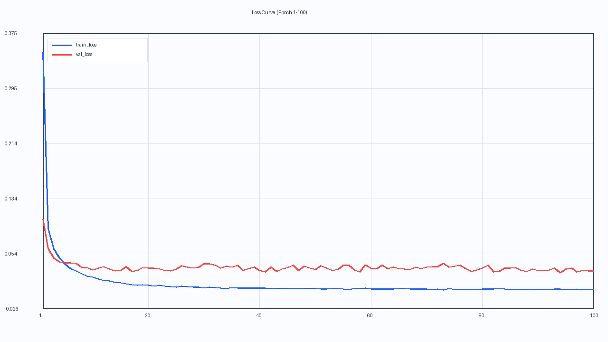

# ✍️ MINST 手写数字识别实验

------

## 📘 引言

​	深度学习，只要方向正确，最终一定能获得成效，难就难在如何确定正确的方向。最开始有许多种机器学习方法，最终深度学习从中胜出，正是因为在关键的时间节点“试出”了正确的方向。从 AlexNet 之后，天下英雄犹如过江之鲫，人们提出了一个个实力强劲的神经网络模型：从 CNN，到 Transformer，再到大模型。每一个强力模型的提出，都离不开大量的试验，在无数方向中探索试错，深度学习就是这样的一个学科。

​	此外，虽然这是一个简单的实验，但是我把这个实验做得“工程化”了一点，可以让大家以小见大，体验一下深度学习业界的一些流程设计。当然，作者水平也是很有限的，写这篇文章一是帮助大家进步，二是促进自己进步，让各位热爱 AI 的有志之士有一个富有成就感的起点。

------

## 🛠️ 环境配置

### 💻 基础环境

- 操作系统：Windows 11（使用 WSL，WSL 虚拟机环境中操作系统为 Ubuntu 20.04.6 LTS）
- 电脑显卡与显存：NVIDIA GeForce RTX 4060，8188 MiB
- 显卡数量：单卡
- CUDA 版本：12.9
- Python 版本：3.13.5

- 详细的环境信息：

```text
Time: 2026-04-25 14:44:50 CST
OS: Ubuntu 20.04.6 LTS
Kernel: Linux 6.6.87.2-microsoft-standard-WSL2 x86_64
Python: 3.13.5
Python path: /home/weiyixuan2002621/miniconda3/bin/python
pip: 25.1 (python 3.13)

Key packages:

- torch: 2.9.1+cu128
- torchvision: 0.24.1+cu128
- numpy: 2.3.5
- Pillow(PIL): 12.0.0
- PyYAML(yaml): 6.0.3
- torchaudio: not installed

PyTorch CUDA status:

- torch.cuda.is_available: True
- torch.version.cuda: 12.8
- torch.backends.cudnn.version: 91002
```

### ⚙️ 环境配置流程

------

#### 创建 conda 环境

​	默认你已经下载了 conda 以及配置好了 python 环境，以及有 Linux 环境。我已经有了深度学习的 conda 环境，直接拿来用了，如果需要创建 conda 环境可以按照如下流程：

```bash
conda create -n mnist_env python=3.11 # 创建你的 conda 环境
conda activate mnist_env # 激活你的环境
```

------

#### 进入项目目录

```bash
cd /你的项目路径/MINST
```

------

#### 安装 PyTorch（GPU / CPU 二选一）

​	如果想采用 conda 下载：

- GPU 版（推荐，有 NVIDIA 卡）

```bash
conda install pytorch torchvision pytorch-cuda=12.8 -c pytorch -c nvidia -y
```

- CPU 版

```bash
conda install pytorch torchvision cpuonly -c pytorch -y
```

​	也可以直接使用 pip 下载，更为简单：

```bash
pip install torch torchvision
```

------

#### 安装其余依赖

​	我在本实验中使用到了 YAML。YAML 是一种“配置文件格式”，全称 YAML Ain't Markup Language。特点是可读性强、靠缩进表示层级，常用于配置参数。大模型和深度学习业界常用这种配置方式，一定要了解。

```bash
pip install numpy pillow pyyaml
```

​	draw_app.py 使用到了 Tkinter，如果报错缺少 Tk：

```bash
conda install tk -y
```

------

#### 验证环境是否正确

```bash
python -c "import torch, torchvision, numpy, PIL, yaml; print(torch.__version__, torchvision.__version__); print('cuda:', torch.cuda.is_available())"
```

------

## 🗂️ 文件结构

### 🧱 文件结构图

```text
MINST/
├── configs/
│   └── train.yaml             # 训练参数配置
├── checkpoints/
│   └── mnist_cnn.pt           # 训练得到的模型权重
├── data/
│   └── MNIST/raw/             # 自动下载的 MNIST 原始数据
├── data.py                    # 数据变换与 MNIST 加载
├── dataset.py                 # DataLoader 构建与 train/val/test 划分
├── model.py                   # MNISTCNN 模型定义
├── train.py                   # 训练入口（支持 YAML）
├── eval.py                    # 评估入口（加载 checkpoint）
└── draw_app.py                # 手写板 GUI 推理
```

​	深度学习的项目大致都遵循如下顺序：搜集数据、处理数据、用数据训练模型、使用模型。我们在本实验中也同样遵循这样的顺序：data.py 负责加载数据、dataset.py 负责划分处理数据、train.py 负责用数据训练模型、draw_app.py 则是一个使用我们训练好的模型的小程序，读者可以在上面试着写数字来识别。



​	但是上述流程太理想了，我们很有可能失败，很有可能犯错，如果失败了怎么办？犯错了怎么办？训练的时候看起来正常，一到应用的时候总是出问题怎么办？所以我们还需要 eval.py 来评估我们的模型是否能够圆满完成任务，并且模型训练途中增加检查点，保存在文件夹 checkpoints 中。（我没有实际设置检查点，但是工业实现必须有这个实现）

​	现在 AI 工具很发达。代码中有什么不懂的，可以直接问 AI，详细讲每一步怎么处理的没有什么意义。这里就不对每个文件中的实现作深入讲解了，功能划分已经很明确了。

### 💻 相关命令行

​	按照如下的命令行一步步完成训练、评估。

#### 🚀 训练

```bash
python train.py --config configs/train.yaml
```

#### ✅ 评估

```bash
python eval.py --checkpoint ./checkpoints/mnist_cnn.pt
```

#### 🖌️ 手写识别 GUI

```bash
python draw_app.py --checkpoint ./checkpoints/mnist_cnn.pt --device cpu
```

如果 CUDA 可用：

```bash
python draw_app.py --checkpoint ./checkpoints/mnist_cnn.pt --device cuda
```

### 🎛️ 参数设置

​	所有要修改的参数我都放入了 train.yaml。

```yaml
data_dir: ./data # 数据根目录
batch_size: 64 # 每步训练样本数。64 比较稳，显存占用适中。
num_workers: 2 # DataLoader 并行加载进程数。Windows/WSL 下 2 通常安全。
epochs: 100 # 训练轮次，其实 20 轮就差不多了
lr: 0.0001 # 学习率偏保守，训练稳定但收敛会慢
weight_decay: 0.0001 # L2 正则，能抑制过拟合
val_split: 0.1 # 训练集切 10% 做验证集
seed: 42
device: cuda # 优先用 GPU，代码会自动回退到 CPU
checkpoint: ./checkpoints/mnist_cnn.pt
max_train_batches: 0
max_eval_batches: 0
```

### 🧠 模型架构

​	模型在 model.py (line 4)，是一个 3 层卷积 + 2 层全连接的 CNN，专门做 MNIST（1x28x28）分类。

**结构**（最新的 GPT 生成图片能力还是太强了）：


## 📊 实验记录

### 📈 训练数据


```bash
(minimind) weiyixuan2002621@weiyixuan2025:~/code_projects/MINST$ python train.py --config configs/train.yaml
/home/weiyixuan2002621/miniconda3/envs/minimind/lib/python3.11/site-packages/torch/cuda/__init__.py:63: FutureWarning: The pynvml package is deprecated. Please install nvidia-ml-py instead. If you did not install pynvml directly, please report this to the maintainers of the package that installed pynvml for you.
  import pynvml  # type: ignore[import]
Loaded config: configs/train.yaml
Epoch 1/100 | train_loss=0.3472 train_acc=0.8964 | val_loss=0.1045 val_acc=0.9690
Epoch 2/100 | train_loss=0.0905 train_acc=0.9726 | val_loss=0.0613 val_acc=0.9830
Epoch 3/100 | train_loss=0.0608 train_acc=0.9816 | val_loss=0.0475 val_acc=0.9853
Epoch 4/100 | train_loss=0.0474 train_acc=0.9856 | val_loss=0.0421 val_acc=0.9868
Epoch 5/100 | train_loss=0.0391 train_acc=0.9876 | val_loss=0.0406 val_acc=0.9885
Epoch 6/100 | train_loss=0.0324 train_acc=0.9900 | val_loss=0.0404 val_acc=0.9897
Epoch 7/100 | train_loss=0.0285 train_acc=0.9909 | val_loss=0.0402 val_acc=0.9883
Epoch 8/100 | train_loss=0.0249 train_acc=0.9923 | val_loss=0.0337 val_acc=0.9897
Epoch 9/100 | train_loss=0.0215 train_acc=0.9931 | val_loss=0.0336 val_acc=0.9912
Epoch 10/100 | train_loss=0.0195 train_acc=0.9936 | val_loss=0.0299 val_acc=0.9922
Epoch 11/100 | train_loss=0.0170 train_acc=0.9947 | val_loss=0.0328 val_acc=0.9905
Epoch 12/100 | train_loss=0.0152 train_acc=0.9950 | val_loss=0.0348 val_acc=0.9905
Epoch 13/100 | train_loss=0.0140 train_acc=0.9954 | val_loss=0.0318 val_acc=0.9913
Epoch 14/100 | train_loss=0.0125 train_acc=0.9958 | val_loss=0.0289 val_acc=0.9908
Epoch 15/100 | train_loss=0.0118 train_acc=0.9963 | val_loss=0.0296 val_acc=0.9918
Epoch 16/100 | train_loss=0.0104 train_acc=0.9966 | val_loss=0.0350 val_acc=0.9915
Epoch 17/100 | train_loss=0.0089 train_acc=0.9972 | val_loss=0.0281 val_acc=0.9913
Epoch 18/100 | train_loss=0.0082 train_acc=0.9973 | val_loss=0.0297 val_acc=0.9915
Epoch 19/100 | train_loss=0.0088 train_acc=0.9971 | val_loss=0.0337 val_acc=0.9913
Epoch 20/100 | train_loss=0.0079 train_acc=0.9974 | val_loss=0.0330 val_acc=0.9907
Epoch 21/100 | train_loss=0.0066 train_acc=0.9978 | val_loss=0.0327 val_acc=0.9910
Epoch 22/100 | train_loss=0.0078 train_acc=0.9970 | val_loss=0.0313 val_acc=0.9922
Epoch 23/100 | train_loss=0.0065 train_acc=0.9979 | val_loss=0.0292 val_acc=0.9917
Epoch 24/100 | train_loss=0.0061 train_acc=0.9980 | val_loss=0.0288 val_acc=0.9930
Epoch 25/100 | train_loss=0.0053 train_acc=0.9982 | val_loss=0.0319 val_acc=0.9925
Epoch 26/100 | train_loss=0.0064 train_acc=0.9977 | val_loss=0.0366 val_acc=0.9915
Epoch 27/100 | train_loss=0.0057 train_acc=0.9982 | val_loss=0.0346 val_acc=0.9917
Epoch 28/100 | train_loss=0.0053 train_acc=0.9983 | val_loss=0.0331 val_acc=0.9923
Epoch 29/100 | train_loss=0.0050 train_acc=0.9984 | val_loss=0.0343 val_acc=0.9912
Epoch 30/100 | train_loss=0.0038 train_acc=0.9986 | val_loss=0.0391 val_acc=0.9920
Epoch 31/100 | train_loss=0.0054 train_acc=0.9980 | val_loss=0.0389 val_acc=0.9900
Epoch 32/100 | train_loss=0.0047 train_acc=0.9985 | val_loss=0.0368 val_acc=0.9920
Epoch 33/100 | train_loss=0.0042 train_acc=0.9986 | val_loss=0.0330 val_acc=0.9922
Epoch 34/100 | train_loss=0.0034 train_acc=0.9990 | val_loss=0.0357 val_acc=0.9922
Epoch 35/100 | train_loss=0.0046 train_acc=0.9984 | val_loss=0.0346 val_acc=0.9923
Epoch 36/100 | train_loss=0.0040 train_acc=0.9987 | val_loss=0.0372 val_acc=0.9918
Epoch 37/100 | train_loss=0.0040 train_acc=0.9987 | val_loss=0.0295 val_acc=0.9932
Epoch 38/100 | train_loss=0.0038 train_acc=0.9986 | val_loss=0.0326 val_acc=0.9927
Epoch 39/100 | train_loss=0.0042 train_acc=0.9987 | val_loss=0.0346 val_acc=0.9908
Epoch 40/100 | train_loss=0.0041 train_acc=0.9985 | val_loss=0.0298 val_acc=0.9927
Epoch 41/100 | train_loss=0.0042 train_acc=0.9986 | val_loss=0.0272 val_acc=0.9925
Epoch 42/100 | train_loss=0.0035 train_acc=0.9989 | val_loss=0.0343 val_acc=0.9917
Epoch 43/100 | train_loss=0.0035 train_acc=0.9989 | val_loss=0.0281 val_acc=0.9930
Epoch 44/100 | train_loss=0.0037 train_acc=0.9989 | val_loss=0.0319 val_acc=0.9923
Epoch 45/100 | train_loss=0.0031 train_acc=0.9990 | val_loss=0.0334 val_acc=0.9917
Epoch 46/100 | train_loss=0.0033 train_acc=0.9989 | val_loss=0.0374 val_acc=0.9912
Epoch 47/100 | train_loss=0.0032 train_acc=0.9990 | val_loss=0.0298 val_acc=0.9922
Epoch 48/100 | train_loss=0.0032 train_acc=0.9991 | val_loss=0.0355 val_acc=0.9920
Epoch 49/100 | train_loss=0.0037 train_acc=0.9989 | val_loss=0.0328 val_acc=0.9917
Epoch 50/100 | train_loss=0.0035 train_acc=0.9987 | val_loss=0.0310 val_acc=0.9925
Epoch 51/100 | train_loss=0.0026 train_acc=0.9991 | val_loss=0.0364 val_acc=0.9922
Epoch 52/100 | train_loss=0.0028 train_acc=0.9991 | val_loss=0.0329 val_acc=0.9927
Epoch 53/100 | train_loss=0.0034 train_acc=0.9989 | val_loss=0.0296 val_acc=0.9928
Epoch 54/100 | train_loss=0.0030 train_acc=0.9990 | val_loss=0.0306 val_acc=0.9925
Epoch 55/100 | train_loss=0.0023 train_acc=0.9994 | val_loss=0.0373 val_acc=0.9923
Epoch 56/100 | train_loss=0.0021 train_acc=0.9995 | val_loss=0.0368 val_acc=0.9920
Epoch 57/100 | train_loss=0.0032 train_acc=0.9990 | val_loss=0.0300 val_acc=0.9927
Epoch 58/100 | train_loss=0.0030 train_acc=0.9989 | val_loss=0.0277 val_acc=0.9932
Epoch 59/100 | train_loss=0.0036 train_acc=0.9987 | val_loss=0.0378 val_acc=0.9923
Epoch 60/100 | train_loss=0.0025 train_acc=0.9992 | val_loss=0.0320 val_acc=0.9925
Epoch 61/100 | train_loss=0.0026 train_acc=0.9992 | val_loss=0.0326 val_acc=0.9920
Epoch 62/100 | train_loss=0.0025 train_acc=0.9993 | val_loss=0.0370 val_acc=0.9922
Epoch 63/100 | train_loss=0.0028 train_acc=0.9990 | val_loss=0.0326 val_acc=0.9928
Epoch 64/100 | train_loss=0.0024 train_acc=0.9992 | val_loss=0.0341 val_acc=0.9920
Epoch 65/100 | train_loss=0.0030 train_acc=0.9990 | val_loss=0.0321 val_acc=0.9930
Epoch 66/100 | train_loss=0.0030 train_acc=0.9990 | val_loss=0.0316 val_acc=0.9923
Epoch 67/100 | train_loss=0.0022 train_acc=0.9993 | val_loss=0.0306 val_acc=0.9928
Epoch 68/100 | train_loss=0.0028 train_acc=0.9992 | val_loss=0.0340 val_acc=0.9918
Epoch 69/100 | train_loss=0.0023 train_acc=0.9993 | val_loss=0.0324 val_acc=0.9923
Epoch 70/100 | train_loss=0.0028 train_acc=0.9992 | val_loss=0.0346 val_acc=0.9905
Epoch 71/100 | train_loss=0.0021 train_acc=0.9994 | val_loss=0.0351 val_acc=0.9918
Epoch 72/100 | train_loss=0.0028 train_acc=0.9989 | val_loss=0.0349 val_acc=0.9928
Epoch 73/100 | train_loss=0.0015 train_acc=0.9996 | val_loss=0.0399 val_acc=0.9928
Epoch 74/100 | train_loss=0.0034 train_acc=0.9989 | val_loss=0.0340 val_acc=0.9930
Epoch 75/100 | train_loss=0.0021 train_acc=0.9994 | val_loss=0.0355 val_acc=0.9920
Epoch 76/100 | train_loss=0.0024 train_acc=0.9993 | val_loss=0.0369 val_acc=0.9915
Epoch 77/100 | train_loss=0.0021 train_acc=0.9992 | val_loss=0.0320 val_acc=0.9922
Epoch 78/100 | train_loss=0.0020 train_acc=0.9994 | val_loss=0.0282 val_acc=0.9923
Epoch 79/100 | train_loss=0.0019 train_acc=0.9994 | val_loss=0.0302 val_acc=0.9937
Epoch 80/100 | train_loss=0.0025 train_acc=0.9993 | val_loss=0.0329 val_acc=0.9918
Epoch 81/100 | train_loss=0.0023 train_acc=0.9992 | val_loss=0.0371 val_acc=0.9915
Epoch 82/100 | train_loss=0.0024 train_acc=0.9992 | val_loss=0.0276 val_acc=0.9935
Epoch 83/100 | train_loss=0.0031 train_acc=0.9991 | val_loss=0.0280 val_acc=0.9922
Epoch 84/100 | train_loss=0.0022 train_acc=0.9991 | val_loss=0.0329 val_acc=0.9928
Epoch 85/100 | train_loss=0.0019 train_acc=0.9994 | val_loss=0.0332 val_acc=0.9925
Epoch 86/100 | train_loss=0.0020 train_acc=0.9994 | val_loss=0.0337 val_acc=0.9920
Epoch 87/100 | train_loss=0.0021 train_acc=0.9994 | val_loss=0.0293 val_acc=0.9937
Epoch 88/100 | train_loss=0.0015 train_acc=0.9996 | val_loss=0.0284 val_acc=0.9932
Epoch 89/100 | train_loss=0.0021 train_acc=0.9994 | val_loss=0.0314 val_acc=0.9935
Epoch 90/100 | train_loss=0.0025 train_acc=0.9992 | val_loss=0.0297 val_acc=0.9923
Epoch 91/100 | train_loss=0.0020 train_acc=0.9994 | val_loss=0.0294 val_acc=0.9927
Epoch 92/100 | train_loss=0.0021 train_acc=0.9994 | val_loss=0.0301 val_acc=0.9928
Epoch 93/100 | train_loss=0.0026 train_acc=0.9992 | val_loss=0.0328 val_acc=0.9923
Epoch 94/100 | train_loss=0.0028 train_acc=0.9991 | val_loss=0.0262 val_acc=0.9930
Epoch 95/100 | train_loss=0.0016 train_acc=0.9996 | val_loss=0.0317 val_acc=0.9930
Epoch 96/100 | train_loss=0.0016 train_acc=0.9996 | val_loss=0.0328 val_acc=0.9923
Epoch 97/100 | train_loss=0.0025 train_acc=0.9993 | val_loss=0.0277 val_acc=0.9927
Epoch 98/100 | train_loss=0.0021 train_acc=0.9993 | val_loss=0.0295 val_acc=0.9922
Epoch 99/100 | train_loss=0.0019 train_acc=0.9995 | val_loss=0.0287 val_acc=0.9928
Epoch 100/100 | train_loss=0.0018 train_acc=0.9994 | val_loss=0.0286 val_acc=0.9935
Final test_loss=0.0252 test_acc=0.9935
Best checkpoint saved to: ./checkpoints/mnist_cnn.pt
```

### 🧪 评估结果

> test_loss=0.0259
>
> test_acc=0.9936
